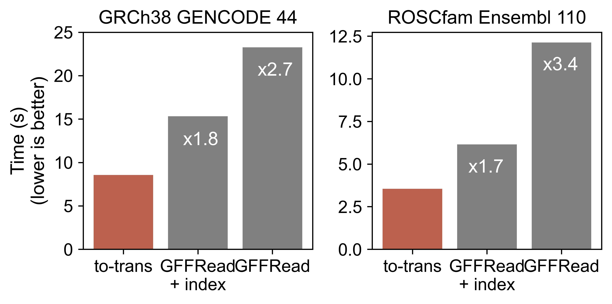

# to-trans

A high-performance exon/CDS spliced transcriptome builder from fasta + GTF/GFF.
This is a command-line tool written in Rust designed to build a transcriptome 
by using a genome (.fa) and a gene model (.gtf/.gff).

## Usage
``` rust
High-performance transcriptome builder from fasta + GTF/GFF

Usage: to-trans [OPTIONS] --fasta <FASTA> --gtf <GTF>

--Arguments:
  -f, --fasta <FASTA>  Path to your .fa file
  -g, --gtf <GTF>      Path to your .gtf file

Options:
  -m, --mode <MODE>      Feature to extract from GTF/GFF file (exon or CDS) [default: exon]
  -o, --out <OUT>      Path to output file [default: transcriptome.fa].
  -h, --help           Print help
  -V, --version        Print version
```

#### crate: [https://crates.io/crates/to-trans](https://crates.io/crates/to-trans)

> Work coming...
>
> to-trans is intended to grow with time, expanding its options and capabilities.
In the next release features like: intron extraction, length-based transcriptomes,
chromosome-specific builds, among others are coming!


## Install/Build
to install to-trans, do:

1. get rust: `curl https://sh.rustup.rs -sSf | sh` on unix, or go [here](https://www.rust-lang.org/tools/install) for other options
2. run `cargo install to-trans` (make sure `~/.cargo/bin` is in your `$PATH` before running it)

to build to-trans, do:

1. get rust (as described above)
2. run `git clone https://github.com/alejandrogzi/to-trans.git && cd to-trans`
3. run `cargo run --release <FASTA> <GTF/GFF> <MODEL> <OUTPUT>`

by default to-trans uses `exon` mode and sends the output to `./transcriptome.fa`

## Benchmark

Besides some particular species, such as human (GRCh38) or mouse (GRCm39) 
that have transcriptomes available, most of the animal kingdom does not 
count with a pre-defined file with transcript sequences. This becomes a 
problem when working at the transcript/isoform level. 

Compared to GFFRead (1), a gff/gtf utility with a vast range of capabilities,
to-trans is able to build a complete transcriptome x2 times faster without the
need of indexing the input genome. On the human model, to-trans reaches 8s tops
while GFFRead max at 15s with an index (.fai) already available. For the dog,
a species without transcript sequences offered in public databases, to-trans
takes 3.5s compared to GFFRead doubled times (6s and 12s for indexed and not 
indexed genomes, respectively).

<p align="center">
    
</p>


to-trans offers a novel option to build a transcriptome from a genome + gene model
in a very efficent manner. This tool provides high-performance and efficiency
without the need of envirnoments or intrincate dependencies, and could be easily
attached to workflows/pipelines.


## References
1. Pertea G and Pertea M. GFF Utilities: GffRead and GffCompare [version 1; peer review: 3 approved]. F1000Research 2020, 9:304 (https://doi.org/10.12688/f1000research.23297.1) [https://github.com/gpertea/gffread]
